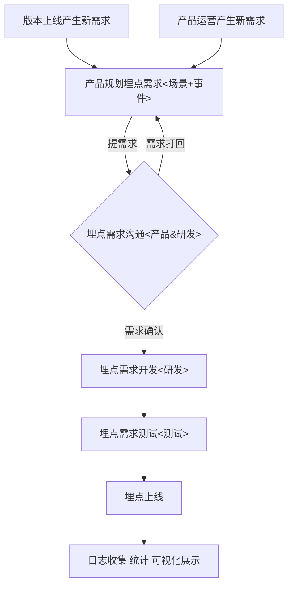

### 埋点需求

​    埋点是数据收集的重要部分，在应用中特定的流程收集信息，用来跟踪应用使用的状况，优化产品或是提供运营的数据支撑。

### 埋点逻辑

#### 埋点需要的基本信息

```

    WHO（用户是谁）：uid、ip、、user-agent、cookie
    WHERE(行为发生位置)：事件是在哪个页面（页面级）、区块、坑位（列表元素、按钮）发生的
    WHAT（事件类型）：曝光（页面曝光、列表曝光、弹窗）、点击
    HOW(行为类型)：收藏、加购、对比服务、分享、购买
    WHY(行为对象信息)：如搜索框里的搜索事件，信息需要带搜索类型和关键词；服务列表里点击服务需要带服务id、位置（列表里的第几个）；页面导航点击需要带第几级类目、类目id
    WHEN(事件时间)：事件发生时的时间戳
```

#### 埋点时间的组织逻辑

按照资源位+事件的方式描述埋点：

- 资源位
  资源位是按照页面-区块-坑位三级划分的最小粒度资源位
- 事件
  - page_show：
    页面曝光，页面粒度的曝光事件，任何方式（包括：打开页面、跳转到页面、回退到页面）进入页面都会有一次页面曝光
    
  - list_show:
    列表曝光，对于一些有列表的页面（服务列表页）要有列表曝光，如果有分页，每一次分页都会有一次列表曝光
    
  - popup_show:
  
    弹窗曝光，pc页面特有的事件，页面中弹出一个弹窗的曝光
  
  - click：
    点击事件，对每一个有交互设计的场景（banner、商品标题、商品图片、分类导航、按钮）的点击，都会产生一次点击事件


### 埋点规范

#### 埋点字段

| 字段       | 含义                                                         |
| ---------- | ------------------------------------------------------------ |
| uid        | 平台用户uid                                                  |
| ip         | 用户ip                                                       |
| cookie     | 用户当前cookie                                               |
| ua         | 用户浏览器的user-agent                                       |
| referer    | 网页是从哪个页面链接过来，只在页面曝光事件上报<br />(本字段不是HTTP协议里的规范，只是表示我们对当前页面的前一个页面的标识，目前前端用路由来作为这个标识) |
| platform   | pc/h5                                                        |
| channel    | 推广渠道，预留字段                                           |
| event_type | 事件类型：<br />page_show  页面曝光<br />list_show  列表曝光<br />popup_show 弹窗曝光<br />click  点击事件 |
| kv         | kv字典格式数据:<br />必备字段：router(行为发生的页面标识)<br />重要字段：id  详情页如服务、线索等的id；<br />                   rname 资源位名称 |
| ts_fe      | 事件发生的时间戳，精确到ms，前端上报（前端上报时间可能不准，但能保证日志时序） |
| ts_be      | 事件发生的时间戳，精确到ms，后端上报（后端接收上报时间，相对准确，不能保证日志时序） |

#### 各事件类型对应的kv示例

| event_type | kv示例                                                       | 说明                                                         |
| ---------- | ------------------------------------------------------------ | ------------------------------------------------------------ |
| page_show  | {<br/>  "router":"shop-archives",<br/>  "id":"103"<br/>}     | router  曝光页面<br />id  店铺id                             |
| list_show  | {<br/>  "router":"shop/shop-list",<br/>  "category":"全部",<br/>  "district":"全部",<br/>  "tab":"综合",<br/>  "ids":"101,103,8,102,34,53"<br/>} | router  曝光发生的页面（如果页面内有多个列表，需要添加区块做区分）<br />category  列表页的选择分类<br />district  列表页的选择地区<br />tab  排序选项 |
| click      | {<br/>  "router":"shop/shop-index",<br/>  "id":"103",<br/>  "rname":"店铺档案"<br/>} | router  被点击位置所在的页面<br />id  点击店铺的id<br />rname  点击资源位的名称 |

#### 完整示例


### 埋点开发流程



### 其它问题

1、埋点需求按页面和公共组件来组织，提给前端埋点

2、埋点需求评审前先和数据平台过一下，确认统计需求和相关的埋点字段


